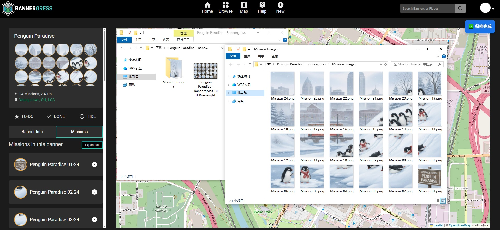

# 🛰️ Bannergress Image Downloader (Original s0)

  

# 🛰️ Bannergress Image Downloader (Original s0)

[English](#english) | [日本語](#日本語) | [中文](#中文)

---

## 🌐 English

### 💡 About
A powerful browser script designed for Ingress Agents to archive Bannergress missions. It automatically captures both high-resolution mission icons and official composite preview images.

### ✨ Key Features
* **Auto-Archiving**: Creates a main folder named after the Banner.
* **Smart Structure**: Saves the preview image in the root and mission icons in a `Mission_Images` sub-folder.
* **High Quality**: Automatically replaces thumbnail URLs with original high-resolution (`=s0`) links.
* **Multi-language**: Interface automatically adapts to EN, ZH, JP, ES, DE, FR, and MS.

### 🚀 Instructions
1. Install [Tampermonkey](https://www.tampermonkey.net/) extension.
2. Click on `bannergress-downloader.user.js` in this repo, click **Raw** to install.
3. Open any banner page on [Bannergress](https://bannergress.com/), expand the mission list.
4. Click the **"🚀 Archive Full Set"** button at the top right.

---

## 🇯🇵 日本語

### 💡 概要
Ingress エージェント向けに開発された、Bannergress のミッション画像をアーカイブするためのスクリプトです。ミッションアイコンと公式のバナープレビュー画像を自動的に取得します。

### ✨ 主な機能
* **自動アーカイブ**: バナー名でメインフォルダを自動作成します。
* **構造化保存**: プレビュー画像をルートに、ミッションアイコンを `Mission_Images` サブフォルダに整理して保存します。
* **高品質**: すべての画像をオリジナルの高解像度（`=s0`）でダウンロードします。
* **多言語対応**: ブラウザの言語設定に合わせて、ボタン表示が自動的に切り替わります（日本語対応）。

### 🚀 使用方法
1. [Tampermonkey](https://www.tampermonkey.net/) をインストールします。
2. このリポジトリの `bannergress-downloader.user.js` を開き、**Raw** ボタンを押してインストールします。
3. Bannergress でバナーページを開き、ミッションリストを展開します。
4. 右上の **"🚀 全画像をダウンロード"** ボタンをクリックします。

---

## 🇨🇳 中文

### 💡 项目简介
专为 Ingress 特工开发的 Bannergress 任务图像存档工具。支持一键获取高清任务图标及官方合成的 Banner 预览长图。

### ✨ 核心功能
* **自动归档**：以 Banner 标题自动创建主文件夹。
* **结构化整理**：Banner 预览图存放在主目录，所有单图存放在 `Mission_Images` 子文件夹。
* **高清原图**：自动将缩略图地址替换为 Google 服务器的原始高清（`=s0`）地址。
* **多国语言**：UI 界面根据浏览器语言自动切换（支持简/繁中文、英、日、西、德、法、马来语）。

### 🚀 使用说明
1. 确保安装了 [Tampermonkey](https://www.tampermonkey.net/) 插件。
2. 点击本仓库中的 `bannergress-downloader.user.js`，点击 **Raw** 按钮完成安装。
3. 打开 Bannergress 任务页面，**点击 Expand All 展开任务列表**。
4. 点击页面右上方蓝色的 **"🚀 一键归档全套"** 按钮。

---

## ⚖️ Disclaimer / 免責事項 / 声明
* Image copyrights belong to original authors, Niantic, and respective owners.
* This tool is for personal use and DIY only. **Commercial use is strictly prohibited**.
* 2026-04-06 Update v2.2: Standardized folder naming to `Mission_Images`.
